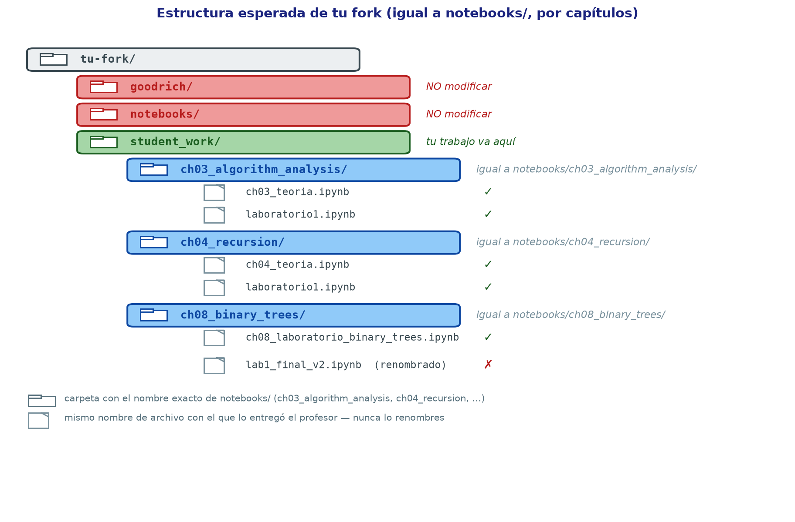

# Estructuras de Datos y Algoritmos en Python

Repositorio del curso **Estructuras de Datos y Algoritmos con Python**, basado en **Goodrich, Tamassia & Goldwasser**.

Todo el curso se trabaja en la nube con **GitHub Codespaces**: no necesitas instalar Python, Jupyter ni nada en tu computador.

> 💻 **¿No puedes usar Codespaces?** (por ejemplo, la red de tu universidad los bloquea)
> Usa la alternativa con Google Colab: [README_COLAB.md](README_COLAB.md).

---

## Antes de empezar: entiende el flujo

Vas a trabajar sobre **tu propia copia** del repositorio del profesor (un *fork*), dentro de un
computador virtual gratuito de GitHub (un *Codespace*). Todo lo que hagas se guarda con **git**,
subiendo tus cambios (*push*) a tu fork. El profesor nunca toca tu copia — es 100% tuya.

```
Repo del profesor  --(fork)-->  Tu fork  --(Codespace)-->  Editas y guardas (commit + push)
       ↑                                                              │
       └───────────── (fetch + rebase, cuando el profesor publique) ──┘
```

---

## Paso 1 — Haz un fork del repositorio

1. Entra a `https://github.com/arleyfernandotorresgalindo/ED_2026_02_v2`
2. Haz clic en **Fork** (arriba a la derecha)
3. Confirma con **Create fork**

Ahora tienes tu propia copia en `https://github.com/TU-USUARIO/ED_2026_02_v2`.
👉 De aquí en adelante, trabajas siempre **en tu fork**, nunca en el del profesor.

---

## Paso 2 — Abre tu fork en un Codespace

Dentro de **tu fork** (no el del profesor):

1. Haz clic en el botón verde **Code**
2. Ve a la pestaña **Codespaces**
3. Haz clic en **Create codespace on main**

⏳ La primera vez tarda unos minutos: se instala Python 3.12, Jupyter y todas las librerías del curso
automáticamente. No necesitas configurar nada.

Las siguientes veces, solo entra a tu fork y abre el Codespace que ya existe (pestaña **Codespaces**
te lo mostrará listo, sin esperar).

---

## Paso 3 — Ubícate en la estructura del repositorio

```
.
├── goodrich/        # Código fuente del libro — NO modificar
├── notebooks/       # Notebooks de teoría de cada clase — NO modificar
└── student_work/    # ← AQUÍ VA TODO TU TRABAJO
```

| Carpeta | ¿Puedo escribir aquí? | ¿Qué hay ahí? |
|---|---|---|
| `goodrich/` | 🔴 No | Implementaciones del libro guía, se actualiza desde otro repo |
| `notebooks/` | 🔴 No | Teoría y ejercicios que trae el profesor cada clase |
| `student_work/` | 🟢 Sí, siempre | Tus notebooks, tus soluciones, tus notas |

Si guardas algo fuera de `student_work/`, corres el riesgo de que se sobreescriba la próxima vez que
traigas actualizaciones del profesor (Paso 5). Guarda **siempre** ahí.

### Cómo organizar `student_work/`

Dentro de `student_work/` organiza tu trabajo **por capítulos, con el mismo nombre de carpeta que usa
`notebooks/`** (`ch03_algorithm_analysis/`, `ch04_recursion/`, `ch08_binary_trees/`...). Es literalmente
copiar y pegar cada carpeta: cuando resuelvas un laboratorio o ejercicio que el profesor entregó en
`notebooks/`, crea en `student_work/` una carpeta con el **nombre exacto** de esa carpeta de `notebooks/`
y copia ahí el archivo **sin cambiarle el nombre**. No uses la numeración corta de `goodrich/` (`ch03/`,
`ch04/`) — esa es la del código del libro, no la de tu entrega.

Esto importa porque los scripts de calificación buscan tu trabajo por nombre de archivo. Si renombras un
notebook (por ejemplo a `lab_final_v2.ipynb`), el corrector no lo va a encontrar y tu entrega puede quedar
sin calificar aunque el contenido esté perfecto.

<p align="center">
  
</p>

---

## Paso 4 — Guarda tu trabajo (commit + push)

Cada vez que avances, sube tus cambios a tu fork en GitHub. Sin este paso, tu trabajo solo existe
dentro del Codespace y se puede perder.

**Opción A — Panel Source Control de VS Code (recomendado si no usas git a menudo)**

1. Haz clic en el ícono de rama en la barra lateral izquierda (Source Control)
2. Escribe un mensaje corto describiendo lo que hiciste
3. Haz clic en **Commit**, luego en **Sync Changes** (o **Push**)

**Opción B — Terminal**

```bash
git add student_work/
git commit -m "descripción de lo que hice"
git push
```

💡 Guarda con frecuencia — cada ejercicio resuelto, cada notebook terminado. No dejes todo para el final.

---

## Paso 5 — Trae material nuevo del profesor

Cuando el profesor publique notebooks o cambios nuevos, tráelos a tu fork con estos pasos.

**Solo la primera vez**, conecta tu fork con el repositorio del profesor:

```bash
git remote add upstream https://github.com/arleyfernandotorresgalindo/ED_2026_02_v2.git
```

**Cada vez que quieras actualizar:**

```bash
git fetch upstream             # Trae lo nuevo del profesor
git rebase upstream/main       # Pone tu copia al día
git submodule update           # Actualiza el código del libro (goodrich/)
git push origin main --force   # Sube tu copia actualizada a tu fork
```

Esto trae el material nuevo sin borrar nada de lo que tengas en `student_work/`.

> ⚙️ Si tu Codespace no aplicó esta configuración automáticamente, corre una sola vez:
> ```bash
> git config merge.ours.driver true
> ```
> Esto evita conflictos falsos cuando el profesor actualiza los notebooks.

---

## Uso de Jupyter

1. Ve a la carpeta `notebooks/`
2. Abre el archivo `.ipynb` de la clase
3. Cuando te lo pida, selecciona el kernel **Python 3.12**

---

## Flujo de trabajo de cada clase

1. Revisa la teoría en `notebooks/`
2. Resuelve los ejercicios y guarda tus avances en `student_work/`
3. Haz **commit + push** antes de cerrar el Codespace (Paso 4)
4. Si el profesor publicó algo nuevo, tráelo con el Paso 5

---

## Problemas comunes

**No me aparecen los cambios del profesor**

```bash
git fetch upstream
git rebase upstream/main
git submodule update
git push origin main --force
```

**Error al hacer rebase porque tengo cambios sin guardar**

```bash
git stash
git rebase upstream/main
git stash pop
git push origin main --force
```

**Perdí mi Codespace o se me cerró sin avisar**

Tu trabajo está a salvo mientras hayas hecho `commit` + `push` (Paso 4). Si no alcanzaste a hacerlo,
puedes reabrir el Codespace desde la pestaña **Codespaces** de tu fork — normalmente conserva el
estado en el que quedó.

---

## Horarios Pitágoras

| Día       | Horario |
|-----------|---------|
| Lunes | 9 - 10 |
| Miércoles    | 9 - 10   |
| Viernes   | 9 - 10 |

---

## 👨‍🏫 Autor

Curso diseñado por **Arley Fernando Torres Galindo**.

---

## Consulta de notas

Escanea el código QR o entra directamente al enlace para consultar tus notas:

<p align="center">
  
</p>

🔗 [Consultar notas](https://script.google.com/macros/s/AKfycbws2_O9VlGq6_hwd5f01ZNrIDkbQVNcQrbs0wgA0kQhBign0fXPBoqzowuIDOTOPAfs6g/exec)

`https://script.google.com/macros/s/AKfycbws2_O9VlGq6_hwd5f01ZNrIDkbQVNcQrbs0wgA0kQhBign0fXPBoqzowuIDOTOPAfs6g/exec`
